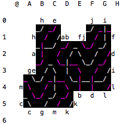

# Trax engine KizuNa

**Trax** engine written in C++14

KizuNa got **2nd place** in **The 2nd RECONF/CPSY/ARC/GI Trax Design Competition** (2016)

http://trax-fit2016.github.io/contest/ (Japanese page)

## Rule of Trax game

http://www.traxgame.com/about_rules.php (English)

http://www.tantrix.jp/trax/trax_rule.htm (Japanese)

## Trax notation

http://lut.eee.u-ryukyu.ac.jp/traxwiki/index.php?%E3%83%AB%E3%83%BC%E3%83%AB#notation (Japanese)

## How to build

`make release`

or

`make release -j4`

## Usage

./out/release/kizuna_engine

trax engine with stdin, stdout (HUMAN vs. CPU)

./out/release/kizuna_client

trax engine with TCP-IP communication (mainly CPU vs. CPU)

protocol in competition is here (http://lut.eee.u-ryukyu.ac.jp/traxwiki/ ; Japanese)

### commands before game

**-W**

game start (CPU is 1st player)

**-B**

game start (CPU is 2nd player)

**-M (Trax Notation)**

do 1 move

**-U**

undo 1 move

**-I**

initialize board

**-R (Trax Notations) -F**

do moves

examples : `-R @0+ B1+ -F -W`

then game will starts after "@0+ B1+"

**-E**

exit program

**-T**

send team code (competition protocol)

### commands in game

**(Trax Notation)**

send your move (when CPU vs. CPU, opponent's move)

**-U**

undo 2 moves

**-E**

exit from game

## Acknowledgements

some codes of KizuNa are based on Gikou (https://github.com/gikou-official/Gikou) or Yaneuraou (https://github.com/yaneurao/YaneuraOu), which are both strong Shogi (Japanese Chess) engine.
